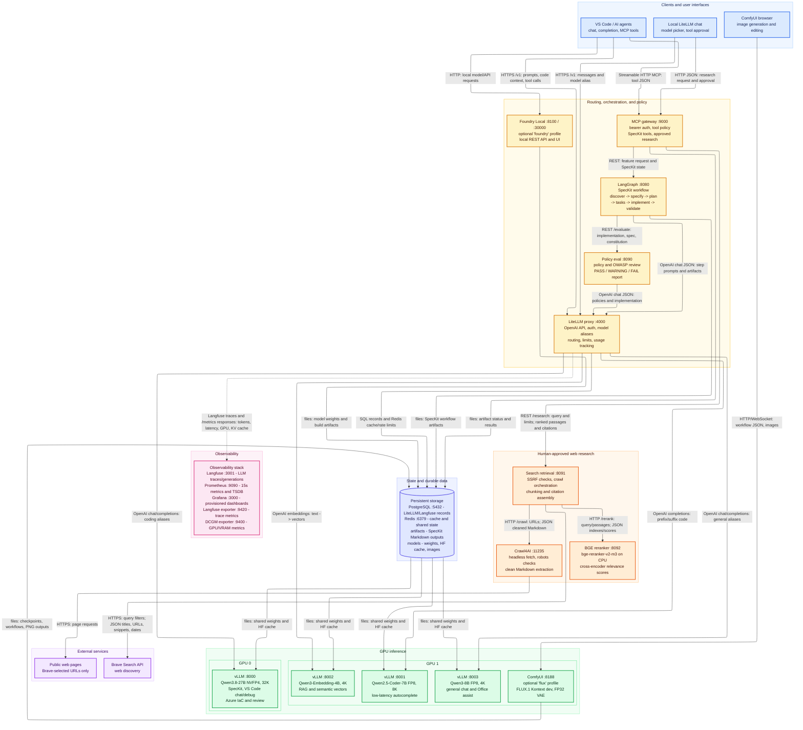

# Local AI Stack

A self-hosted, GPU-accelerated AI development environment running multiple LLMs via vLLM, routed through LiteLLM, with observability, orchestration, and tooling for AI-assisted software engineering.

## Architecture Overview



Colors identify component roles: blue for clients, amber for routing and
orchestration, green for model inference, orange for retrieval, purple for
external systems, indigo for storage, and pink for observability. Dashed lines
represent telemetry collection; solid lines carry application or persistence
data. Foundry Local and ComfyUI/FLUX are opt-in Compose profiles.

## Web Research Flow

The local web research pipeline runs in this sequence:

1. Brave search
2. Crawl4AI fetch/extract for each result
3. text chunking
4. BGE rerank
5. return ranked passages back to the app

This is the flow used by the search-retrieval service in [workspace/search-retrieval/server.py](workspace/search-retrieval/server.py) and the reranker in [workspace/bge-reranker/server.py](workspace/bge-reranker/server.py).

### 1) Brave Search: sources
The process starts with Brave Search, which returns candidate web pages. Each result becomes a source record with metadata such as:

- title
- URL
- description
- published date

These source items are the web pages the system is willing to investigate. They are not the final answer yet; they are the raw candidates discovered by the search engine.

### 2) Crawl4AI fetch/extract: page content
For each source, the system calls Crawl4AI to fetch and extract page text. Crawl4AI removes boilerplate and extracts readable markdown/text from the page. At this stage, the app has page content, but not yet a clean, tightly scoped retrieval unit.

### 3) Chunking: passages
The extracted page text is then split into smaller, more manageable text blocks called chunks or passages. A chunk is a section of a page that fits within a bounded size and is easier for a retrieval/reranking model to evaluate. Each chunk keeps metadata like:

- source title
- source URL
- heading (when available)
- text content
- publication time

These chunks are the actual retrieval candidates that will later be ranked for relevance.

### 4) BGE rerank: relevance scoring
The search-retrieval service sends the query together with all candidate chunks to the BGE reranker. The reranker is a cross-encoder model that scores each query/chunk pair. In other words, it answers: "How relevant is this chunk to the user query?"

The reranker then sorts by score and keeps the most relevant ones at the top. The result is a final ranked list of passages, not a flat list of source pages. The score is the relevancy estimate that decides which evidence should be surfaced first.

### 5) Return to the app
Once the passages are reranked, the result is returned to the application as a final research response with:

- the original query
- the ranked passages
- the source list that produced them
- any crawl failures or warnings

In summary:

- sources = pages discovered by search
- chunks/passages = text slices extracted from those pages
- reranking = reordering chunks by relevance to the query
- final output = the highest-quality evidence returned to the app

## Directory Structure

```
.
├── cache/                          # Runtime caches — not committed
│   ├── build/                      # Docker build layer cache
│   ├── docker/                     # Docker image cache
│   ├── huggingface/
│   │   └── hub/                    # HuggingFace model shard cache
│   │       ├── models--Qwen--Qwen2.5-Coder-32B-Instruct/
│   │       ├── models--Qwen--Qwen2.5-Coder-7B-Instruct/
│   │       ├── models--Qwen--Qwen3-8B/
│   │       └── models--Qwen--Qwen3-Embedding-4B/
│   ├── pip/
│   │   └── hf-download-venv/       # Python venv for model download scripts
│   └── poetry/                     # Poetry dependency cache
│
├── config/                         # Static service configuration — committed
│   ├── docker/
│   │   ├── buildkit.toml           # BuildKit daemon config
│   │   └── daemon.json             # Docker daemon config
│   ├── env/
│   │   ├── base.env                # Shared environment variables
│   │   ├── dev.env                 # Development profile overrides
│   │   └── gpu.env                 # GPU-specific overrides
│   ├── grafana/
│   │   ├── dashboards/             # Dashboard JSON sources
│   │   └── provisioning/           # Grafana provisioning config
│   ├── langgraph/                  # LangGraph service config
│   ├── litellm/
│   │   ├── litellm.config.yaml     # Model list, routing, per-model params
│   │   └── routing.config.yaml     # Load-balancing and fallback rules
│   ├── otel/
│   │   └── config.yaml             # OpenTelemetry collector config
│   ├── policies/                   # OPA / policy documents for policy-eval
│   └── prometheus/
│       └── prometheus.yml          # Scrape targets
│
├── data/                           # Persistent runtime data — not committed
│   ├── artifacts/
│   │   └── builds/
│   │       └── speckit/            # SpecKit pipeline output artefacts
│   ├── db/
│   │   ├── postgres/               # PostgreSQL data directory
│   │   └── sqlite/                 # SQLite databases
│   ├── grafana/                    # Grafana state (dashboards, plugins, exports)
│   │   ├── csv/ pdf/ png/          # Dashboard exports
│   │   ├── dashboards/
│   │   ├── grafana-apiserver/
│   │   ├── plugins/
│   │   └── unified-search/
│   ├── logs/                       # Per-service log files
│   │   ├── langgraph/
│   │   ├── litellm/
│   │   ├── vllm-gpu0/
│   │   ├── vllm-gpu1/
│   │   ├── vllm-qwen-coder-fast-gpu1/
│   │   ├── vllm-qwen3-coder-gpu0/
│   │   ├── vllm-qwen3-embedding-gpu1/
│   │   └── vllm-qwen3-general-gpu1/
│   ├── prometheus/                 # Prometheus TSDB blocks + WAL
│   ├── redis/                      # Redis AOF + RDB persistence
│   └── vectorstores/
│       └── chroma/                 # ChromaDB persistent store
│
├── models/                         # Model weight storage
│   ├── cache/
│   │   ├── huggingface/            # Secondary HF cache
│   │   └── vllm/                   # vLLM compiled model cache
│   ├── embedding/
│   │   ├── bge/                    # BGE embedding models
│   │   ├── e5/                     # E5 embedding models
│   │   └── qwen3-embedding/        # Qwen3-Embedding-4B
│   ├── foundation/
│   │   ├── codellama/
│   │   ├── deepseek/
│   │   ├── glm/
│   │   ├── llama/
│   │   ├── qwen-coder-fast/        # Qwen2.5-Coder-7B  (GPU1 · fast chat + FIM)
│   │   ├── qwen3.8-27b-nvfp4/      # Qwen3.8-27B NVFP4 (GPU0 · primary coding)
│   │   └── qwen3-general/          # Qwen3-8B          (GPU1 · general chat)
│   └── rerankers/
│       └── bge-rerankers/          # BGE cross-encoder rerankers
│
├── runtime/                        # Container runtime definitions
│   ├── compose/
│   │   ├── full/                   # Full stack — primary compose file
│   │   ├── dev/                    # Lightweight profile (no GPU)
│   │   └── gpu/                    # GPU-only vLLM services
│   ├── gpu/
│   │   ├── gpu0/                   # GPU 0 startup / config (Qwen3.8-27B)
│   │   └── gpu1/                   # GPU 1 startup / config (fast models)
│   ├── services/                   # Per-service Dockerfiles / overrides
│   │   ├── foundry-local/
│   │   ├── langfuse/
│   │   ├── langgraph/
│   │   ├── litellm/
│   │   ├── otel/
│   │   └── vllm/
│   ├── vllm/                       # vLLM argument files (per model)
│   │   ├── gpu0/
│   │   ├── gpu1/
│   │   ├── qwen-coder-fast/
│   │   ├── qwen3-coder/
│   │   ├── qwen3-embedding/
│   │   └── qwen3-general/
│   └── volumes/                    # Named-volume bind-mount targets
│       ├── grafana/
│       ├── langfuse/
│       ├── postgres/
│       └── redis/
│
├── tools/                          # Utility scripts
│   ├── cli/
│   │   ├── download-models.sh      # HuggingFace model download helper
│   │   └── gen-topology-diagram.py # Auto-generate architecture diagrams
│   ├── gpu/
│   │   └── nvidia-drv-install.sh   # NVIDIA driver installation
│   └── maintenance/                # DB migrations, cleanup scripts
│
└── workspace/                      # Custom application services (source)
    ├── dashboards/                 # Grafana dashboard source JSON
    ├── experiments/                # Ad-hoc notebooks and experiments
    ├── litellm/                    # LiteLLM customisation / plugins
    ├── mcp-gateway/                # MCP server — exposes tools over HTTP
    │   ├── Dockerfile
    │   ├── requirements.txt
    │   └── server.py               # FastMCP, port 9000
    ├── search-retrieval/           # Brave → Crawl4AI → BGE orchestration
    │   ├── Dockerfile
    │   ├── requirements.txt
    │   └── server.py               # FastAPI, port 8091
    ├── bge-reranker/               # Local cross-encoder inference service
    │   ├── Dockerfile
    │   ├── requirements.txt
    │   └── server.py               # FastAPI, port 8092
    ├── orchestrator/               # LangGraph orchestration service
    │   ├── Dockerfile
    │   ├── requirements.txt
    │   ├── server.py               # FastAPI wrapper, port 8080
    │   ├── config/                 # langgraph.json and service config
    │   └── speckit_graph/          # SpecKit LangGraph pipeline definition
    └── policy-eval/                # LLM-based policy evaluation service
        ├── Dockerfile
        ├── requirements.txt
        └── evaluator.py            # FastAPI, port 8090
```

## Services

| Service | Port | Purpose |
|---|---|---|
| LiteLLM proxy | 4000 | Model routing, auth, rate limiting, usage tracking |
| vLLM GPU 0 | 8000 | Qwen3.8-27B NVFP4 — speckit, vscode.chat, azure IaC |
| vLLM GPU 1 | 8001 | Qwen2.5-Coder-7B — fast chat + FIM autocomplete |
| vLLM GPU 1 | 8002 | Qwen3-Embedding-4B — semantic search / RAG |
| vLLM GPU 1 | 8003 | Qwen3-8B — general chat |
| LangGraph orchestrator | 8080 | SpecKit pipeline execution |
| Policy eval | 8090 | LLM-based policy / code review |
| Search retrieval | 8091 | Brave discovery, Crawl4AI extraction, BGE reranking |
| BGE reranker | 8092 | Local `BAAI/bge-reranker-v2-m3` cross-encoder |
| MCP gateway | 9000 | MCP tool server for VS Code / agents |
| Crawl4AI | 11235 | Authenticated browser extraction API |
| Foundry Local | 8100 | REST API for Foundry Local functionality |
| Langfuse | 3001 | LLM tracing and observability |
| Grafana | 3000 | Metrics dashboards |
| Prometheus | 9090 | Metrics collection |
| PostgreSQL | 5432 | Persistent storage (Langfuse, LiteLLM, app state) |
| Redis | 6379 | Caching, queues, rate limiting |

## LiteLLM Model Aliases

| Alias | Backend | GPU | Context | Purpose |
|---|---|---|---|---|
| `speckit.discover` | Qwen3.8-27B | 0 | 32K | Repo scan, architecture intake |
| `speckit.specify` | Qwen3.8-27B | 0 | 32K | Requirements authoring |
| `speckit.plan` | Qwen3.8-27B | 0 | 32K | Architecture and implementation planning |
| `speckit.tasks` | Qwen3.8-27B | 0 | 32K | Task breakdown |
| `speckit.implement` | Qwen3.8-27B | 0 | 32K | Code generation |
| `speckit.validate` | Qwen3.8-27B | 0 | 32K | Code review, policy validation |
| `vscode.chat` | Qwen3.8-27B | 0 | 32K | VS Code Copilot chat (high quality) |
| `vscode.chat.low` | Qwen3.8-27B | 0 | 32K | VS Code Copilot chat (low reasoning) |
| `vscode.chat.medium` | Qwen3.8-27B | 0 | 32K | VS Code Copilot chat (medium reasoning) |
| `vscode.chat.xhigh` | Qwen3.8-27B | 0 | 32K | VS Code Copilot chat (extra-high reasoning) |
| `vscode.debug` | Qwen3.8-27B | 0 | 32K | Debugging, stack trace analysis |
| `vscode.autocomplete` | Qwen2.5-Coder-7B | 1 | 8K | Fast inline FIM completions |
| `azure.iac` | Qwen3.8-27B | 0 | 32K | Bicep / Terraform / AVM |
| `azure.deploy.review` | Qwen3.8-27B | 0 | 32K | Deployment readiness review |
| `general.chat` | Qwen3-8B | 1 | 4K | General assistant, summarisation, approved web research |
| `office.assist` | Qwen3-8B | 1 | 4K | O365 helper workflows |
| `embeddings` | Qwen3-Embedding-4B | 1 | — | RAG, repo indexing |

## Quick Start

```bash
# Export variables such as BRAVE_SEARCH_API_KEY from the local env file
set -a; source ~/env/base.env; set +a

# Start the full stack
docker compose -f ~/runtime/compose/full/docker-compose.yml up -d

# Restart a single service (e.g. after config change)
docker compose -f ~/runtime/compose/full/docker-compose.yml restart litellm

# View logs
docker compose -f ~/runtime/compose/full/docker-compose.yml logs -f litellm

# Download models
bash ~/tools/cli/download-models.sh
```

## VS Code Integration

In a Remote - WSL window, the chat UI still runs on the Windows extension host and
reads model configuration from the **Windows** settings file:
`C:\Users\hanno\AppData\Roaming\Code\User\chatLanguageModels.json`

This catalog is explicit rather than populated from LiteLLM's `/v1/models` response.
Keep its model IDs and display names aligned with `config/litellm/litellm.config.yaml`,
then run **Developer: Reload Window** after changing it.

LiteLLM requires an API key (the master key enables the admin UI). Add it once in
VS Code via **Command Palette → "GitHub Copilot: Manage Models"** → the
"LiteLLM — Local AI Stack" endpoint, and paste the value of `LITELLM_MASTER_KEY`
(set in the `litellm` service in the compose file).

MCP gateway (`settings.json`):
```json
"mcp": {
  "servers": {
        "local-ai-speckit": {
            "type": "http",
            "url": "http://localhost:9000/mcp",
            "headers": { "Authorization": "Bearer <LITELLM_API_KEY>" }
        }
  }
}
```

The local chat's master-key field authenticates both LiteLLM and the MCP gateway;
the key is not embedded in the HTML or persisted by the page. The MCP gateway exposes
`web_research`, which accepts a query and optional source,
passage, freshness, country, and language limits. It returns reranked passages with
source URLs and crawl timestamps. The local chat uses this tool for current web
information and treats crawled page text as untrusted evidence. The local chat attaches
`web_research` only to `general.chat`; all other model requests omit external tool
definitions. The legacy `web_search` and `current_weather` MCP tools and routes have been
removed.

The gateway is published only on `127.0.0.1:9000`, requires bearer authentication,
and permits browser requests only from the local file origin or configured localhost
origins. Every external search first returns a five-minute, one-time approval challenge
bound to the exact query. The local chat displays that query for explicit approval;
models cannot approve challenges through MCP. Queries containing credential patterns,
private keys, or local filesystem paths are rejected before any external request.
