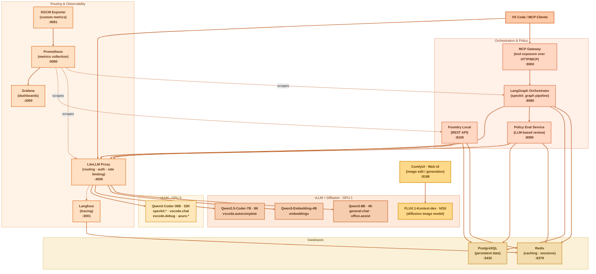

# Local AI Stack

A self-hosted, GPU-accelerated AI development environment running multiple LLMs via vLLM, routed through LiteLLM, with observability, orchestration, and tooling for AI-assisted software engineering.

## Architecture Overview



## Directory Structure

```
.
├── cache/                          # Runtime caches — not committed
│   ├── build/                      # Docker build layer cache
│   ├── docker/                     # Docker image cache
│   ├── huggingface/
│   │   └── hub/                    # HuggingFace model shard cache
│   │       ├── models--Qwen--Qwen2.5-Coder-32B-Instruct/
│   │       ├── models--Qwen--Qwen2.5-Coder-7B-Instruct/
│   │       ├── models--Qwen--Qwen3-8B/
│   │       └── models--Qwen--Qwen3-Embedding-4B/
│   ├── pip/
│   │   └── hf-download-venv/       # Python venv for model download scripts
│   └── poetry/                     # Poetry dependency cache
│
├── config/                         # Static service configuration — committed
│   ├── docker/
│   │   ├── buildkit.toml           # BuildKit daemon config
│   │   └── daemon.json             # Docker daemon config
│   ├── env/
│   │   ├── base.env                # Shared environment variables
│   │   ├── dev.env                 # Development profile overrides
│   │   └── gpu.env                 # GPU-specific overrides
│   ├── grafana/
│   │   ├── dashboards/             # Dashboard JSON sources
│   │   └── provisioning/           # Grafana provisioning config
│   ├── langgraph/                  # LangGraph service config
│   ├── litellm/
│   │   ├── litellm.config.yaml     # Model list, routing, per-model params
│   │   └── routing.config.yaml     # Load-balancing and fallback rules
│   ├── otel/
│   │   └── config.yaml             # OpenTelemetry collector config
│   ├── policies/                   # OPA / policy documents for policy-eval
│   └── prometheus/
│       └── prometheus.yml          # Scrape targets
│
├── data/                           # Persistent runtime data — not committed
│   ├── artifacts/
│   │   └── builds/
│   │       └── speckit/            # SpecKit pipeline output artefacts
│   ├── db/
│   │   ├── postgres/               # PostgreSQL data directory
│   │   └── sqlite/                 # SQLite databases
│   ├── grafana/                    # Grafana state (dashboards, plugins, exports)
│   │   ├── csv/ pdf/ png/          # Dashboard exports
│   │   ├── dashboards/
│   │   ├── grafana-apiserver/
│   │   ├── plugins/
│   │   └── unified-search/
│   ├── logs/                       # Per-service log files
│   │   ├── langgraph/
│   │   ├── litellm/
│   │   ├── vllm-gpu0/
│   │   ├── vllm-gpu1/
│   │   ├── vllm-qwen-coder-fast-gpu1/
│   │   ├── vllm-qwen3-coder-gpu0/
│   │   ├── vllm-qwen3-embedding-gpu1/
│   │   └── vllm-qwen3-general-gpu1/
│   ├── prometheus/                 # Prometheus TSDB blocks + WAL
│   ├── redis/                      # Redis AOF + RDB persistence
│   └── vectorstores/
│       └── chroma/                 # ChromaDB persistent store
│
├── models/                         # Model weight storage
│   ├── cache/
│   │   ├── huggingface/            # Secondary HF cache
│   │   └── vllm/                   # vLLM compiled model cache
│   ├── embedding/
│   │   ├── bge/                    # BGE embedding models
│   │   ├── e5/                     # E5 embedding models
│   │   └── qwen3-embedding/        # Qwen3-Embedding-4B
│   ├── foundation/
│   │   ├── codellama/
│   │   ├── deepseek/
│   │   ├── glm/
│   │   ├── llama/
│   │   ├── qwen-coder-fast/        # Qwen2.5-Coder-7B  (GPU1 · fast chat + FIM)
│   │   ├── qwen3-coder-30b-a3b/    # Qwen3-Coder-30B-A3B AWQ (GPU0 · primary coding)
│   │   └── qwen3-general/          # Qwen3-8B          (GPU1 · general chat)
│   └── rerankers/
│       └── bge-rerankers/          # BGE cross-encoder rerankers
│
├── runtime/                        # Container runtime definitions
│   ├── compose/
│   │   ├── full/                   # Full stack — primary compose file
│   │   ├── dev/                    # Lightweight profile (no GPU)
│   │   └── gpu/                    # GPU-only vLLM services
│   ├── gpu/
│   │   ├── gpu0/                   # GPU 0 startup / config (Qwen3-Coder-30B)
│   │   └── gpu1/                   # GPU 1 startup / config (fast models)
│   ├── services/                   # Per-service Dockerfiles / overrides
│   │   ├── foundry-local/
│   │   ├── langfuse/
│   │   ├── langgraph/
│   │   ├── litellm/
│   │   ├── otel/
│   │   └── vllm/
│   ├── vllm/                       # vLLM argument files (per model)
│   │   ├── gpu0/
│   │   ├── gpu1/
│   │   ├── qwen-coder-fast/
│   │   ├── qwen3-coder/
│   │   ├── qwen3-embedding/
│   │   └── qwen3-general/
│   └── volumes/                    # Named-volume bind-mount targets
│       ├── grafana/
│       ├── langfuse/
│       ├── postgres/
│       └── redis/
│
├── tools/                          # Utility scripts
│   ├── cli/
│   │   ├── download-models.sh      # HuggingFace model download helper
│   │   └── gen-topology-diagram.py # Auto-generate architecture diagrams
│   ├── gpu/
│   │   └── nvidia-drv-install.sh   # NVIDIA driver installation
│   └── maintenance/                # DB migrations, cleanup scripts
│
└── workspace/                      # Custom application services (source)
    ├── dashboards/                 # Grafana dashboard source JSON
    ├── experiments/                # Ad-hoc notebooks and experiments
    ├── litellm/                    # LiteLLM customisation / plugins
    ├── mcp-gateway/                # MCP server — exposes tools over HTTP
    │   ├── Dockerfile
    │   ├── requirements.txt
    │   └── server.py               # FastMCP, port 9000
    ├── orchestrator/               # LangGraph orchestration service
    │   ├── Dockerfile
    │   ├── requirements.txt
    │   ├── server.py               # FastAPI wrapper, port 8080
    │   ├── config/                 # langgraph.json and service config
    │   └── speckit_graph/          # SpecKit LangGraph pipeline definition
    └── policy-eval/                # LLM-based policy evaluation service
        ├── Dockerfile
        ├── requirements.txt
        └── evaluator.py            # FastAPI, port 8090
```

## Services

| Service | Port | Purpose |
|---|---|---|
| LiteLLM proxy | 4000 | Model routing, auth, rate limiting, usage tracking |
| vLLM GPU 0 | 8000 | Qwen3-Coder-30B — speckit, vscode.chat, azure IaC |
| vLLM GPU 1 | 8001 | Qwen2.5-Coder-7B — fast chat + FIM autocomplete |
| vLLM GPU 1 | 8002 | Qwen3-Embedding-4B — semantic search / RAG |
| vLLM GPU 1 | 8003 | Qwen3-8B — general chat |
| LangGraph orchestrator | 8080 | SpecKit pipeline execution |
| Policy eval | 8090 | LLM-based policy / code review |
| MCP gateway | 9000 | MCP tool server for VS Code / agents |
| Foundry Local | 8100 | REST API for Foundry Local functionality |
| Langfuse | 3001 | LLM tracing and observability |
| Grafana | 3000 | Metrics dashboards |
| Prometheus | 9090 | Metrics collection |
| PostgreSQL | 5432 | Persistent storage (Langfuse, LiteLLM, app state) |
| Redis | 6379 | Caching, queues, rate limiting |

## LiteLLM Model Aliases

| Alias | Backend | GPU | Context | Purpose |
|---|---|---|---|---|
| `speckit.discover` | Qwen3-Coder-30B | 0 | 32K | Repo scan, architecture intake |
| `speckit.specify` | Qwen3-Coder-30B | 0 | 32K | Requirements authoring |
| `speckit.plan` | Qwen3-Coder-30B | 0 | 32K | Architecture and implementation planning |
| `speckit.tasks` | Qwen3-Coder-30B | 0 | 32K | Task breakdown |
| `speckit.implement` | Qwen3-Coder-30B | 0 | 32K | Code generation |
| `speckit.validate` | Qwen3-Coder-30B | 0 | 32K | Code review, policy validation |
| `vscode.chat` | Qwen3-Coder-30B | 0 | 32K | VS Code Copilot chat (high quality) |
| `vscode.debug` | Qwen3-Coder-30B | 0 | 32K | Debugging, stack trace analysis |
| `vscode.autocomplete` | Qwen2.5-Coder-7B | 1 | 8K | Fast inline FIM completions |
| `azure.iac` | Qwen3-Coder-30B | 0 | 32K | Bicep / Terraform / AVM |
| `azure.deploy.review` | Qwen3-Coder-30B | 0 | 32K | Deployment readiness review |
| `general.chat` | Qwen3-8B | 1 | 4K | General assistant, summarisation |
| `office.assist` | Qwen3-8B | 1 | 4K | O365 helper workflows |
| `embeddings` | Qwen3-Embedding-4B | 1 | — | RAG, repo indexing |

## Quick Start

```bash
# Start the full stack
docker compose -f ~/runtime/compose/full/docker-compose.yml up -d

# Restart a single service (e.g. after config change)
docker compose -f ~/runtime/compose/full/docker-compose.yml restart litellm

# View logs
docker compose -f ~/runtime/compose/full/docker-compose.yml logs -f litellm

# Download models
bash ~/tools/cli/download-models.sh
```

## VS Code Integration

VS Code reads model configuration from the **Windows** settings file:
`C:\Users\hanno\AppData\Roaming\Code\User\chatLanguageModels.json`

LiteLLM requires an API key (the master key enables the admin UI). Add it once in
VS Code via **Command Palette → "GitHub Copilot: Manage Models"** → the
"LiteLLM — Local AI Stack" endpoint, and paste the value of `LITELLM_MASTER_KEY`
(set in the `litellm` service in the compose file).

MCP gateway (`settings.json`):
```json
"mcp": {
  "servers": {
    "local-ai-speckit": { "type": "http", "url": "http://localhost:9000/mcp" }
  }
}
```
